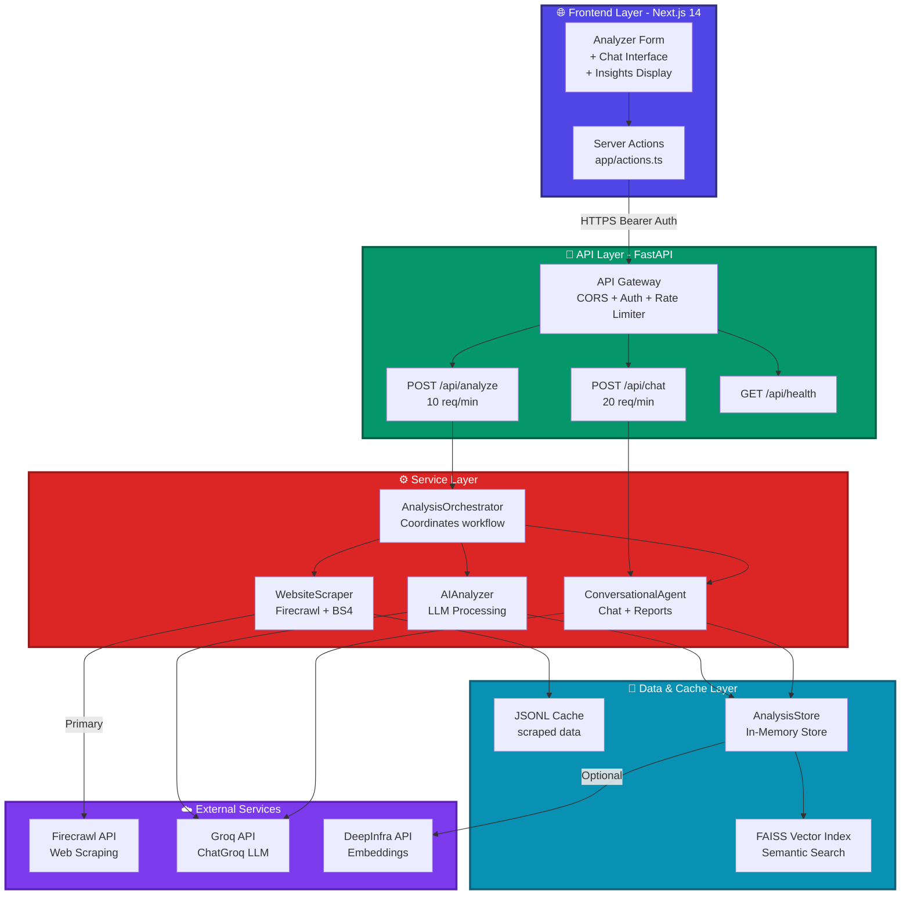
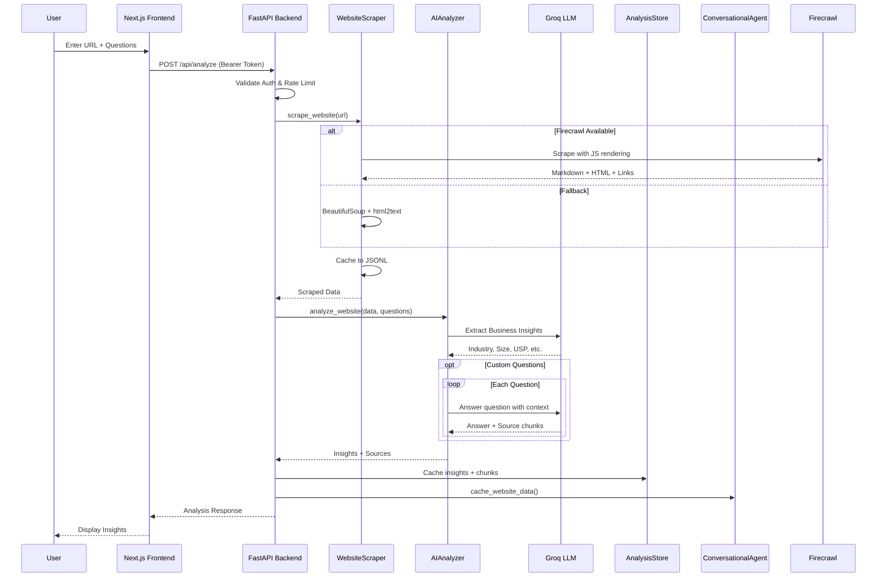
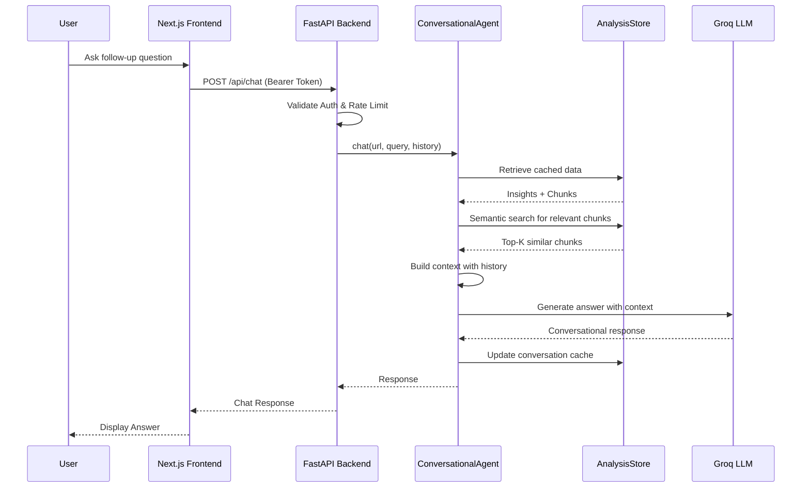
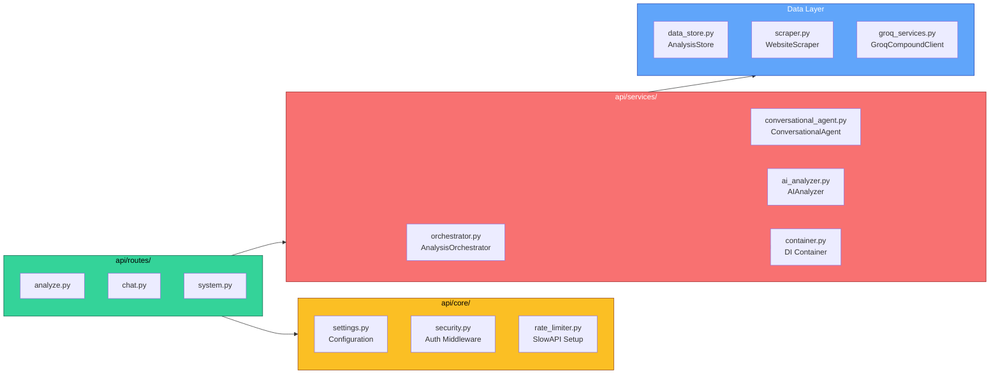
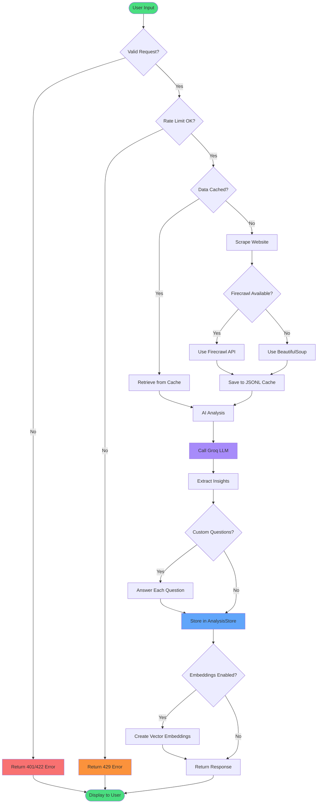
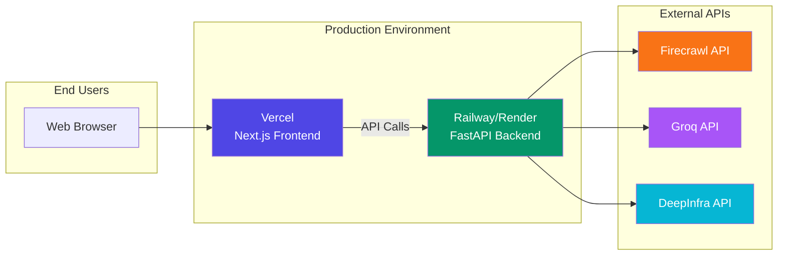
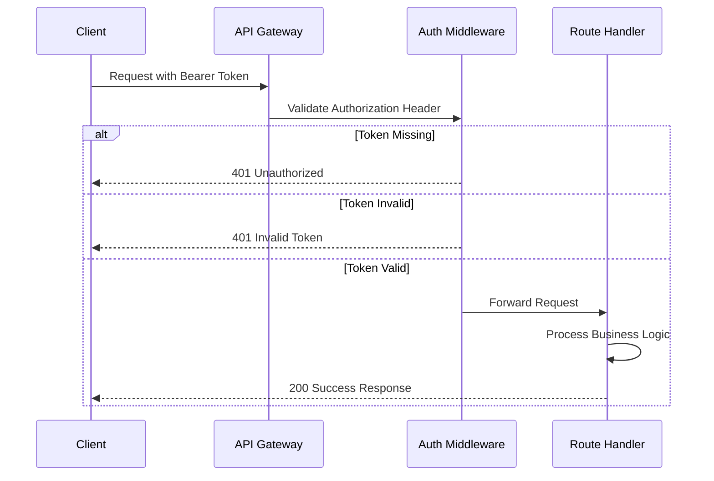

# System Architecture

## High-Level Architecture Diagram

## System Flow - Analysis Request

## System Flow - Chat Request

## Component Architecture

## Data Flow Architecture

## Technology Stack

| Layer | Technology | Purpose |
|-------|-----------|---------|
| **Frontend** | Next.js 14 + TypeScript | Server actions, React Server Components |
| **UI Components** | Tailwind CSS + shadcn/ui | Responsive design system |
| **Backend** | FastAPI + Uvicorn | Async API with auto-docs |
| **LLM** | Groq (ChatGroq) | Fast inference for insights |
| **Web Scraping** | Firecrawl + BeautifulSoup | JS rendering + fallback |
| **Validation** | Pydantic v2 | Type-safe request/response |
| **Rate Limiting** | SlowAPI | Per-route quotas |
| **Embeddings** | DeepInfra (optional) | Semantic search |
| **Vector DB** | FAISS (in-memory) | Similarity search |
| **Testing** | Pytest + TestClient | Comprehensive API tests |
| **Package Manager** | uv (Python) + pnpm (Node) | Fast dependency management |

## Key Design Decisions

### 1. **Two API Endpoints Architecture**
- `/api/analyze`: Heavy computation, rate-limited to 10 req/min
- `/api/chat`: Lightweight queries, rate-limited to 20 req/min
- Separation allows independent scaling and optimization

### 2. **Caching Strategy**
- **JSONL Cache**: Scraped raw data for replay
- **AnalysisStore**: Processed insights + embeddings
- **In-Memory**: Fast access, suitable for prototype scale

### 3. **Fallback Scraping**
- **Primary**: Firecrawl API with JS rendering
- **Fallback**: BeautifulSoup + html2text
- Ensures reliability when Firecrawl unavailable

### 4. **LLM Provider Selection**
- **Groq**: 10x faster than OpenAI (LPU architecture)
- **Cost**: $0.10/1M tokens vs OpenAI $5/1M
- **Compatibility**: Works with LangChain ecosystem

### 5. **Authentication & Security**
- Bearer token validation on all endpoints
- Environment-based secret management
- CORS configured for production domains

### 6. **Rate Limiting Strategy**
- Analysis: 10/min (scraping + LLM heavy)
- Chat: 20/min (cached data, lighter load)
- Prevents abuse while allowing reasonable usage

### 7. **Semantic Search (Optional)**
- DeepInfra embeddings for cost-effectiveness
- FAISS for fast in-memory similarity search
- Enhances chat accuracy with relevant context

## Deployment Architecture

## Security & Authentication Flow

## Future Enhancements

1. **Multi-page Crawling**: Extend scraping to follow internal links with domain guards
2. **Persistent Storage**: Replace in-memory store with PostgreSQL/Redis
3. **Advanced Vector Search**: Integrate pgvector, Pinecone or Weaviate for production scale
4. **Export Features**: Add CSV/PDF export for saved analyses
5. **Webhook Integration**: Push analysis results to external systems
6. **Batch Processing**: Queue system for bulk URL analysis
7. **User Management**: Multi-tenant support with user accounts
8. **Analytics Dashboard**: Track usage patterns and popular queries
