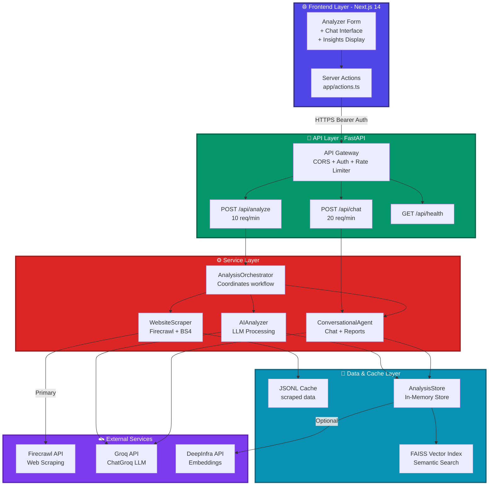

# Firmable AI Business Insight Agent

An end-to-end prototype: scrape a company homepage, derive structured business insights, and support conversational follow
## Deployment Notes

### Current Production Deployment

- **Frontend** – Deployed on Vercel at [firmable-ai-business-searcher.vercel.app](https://firmable-ai-business-searcher.vercel.app/)
  - Uses Next.js 14 server actions and edge-friendly APIs
  - Environment variables configured via Vercel dashboard
  - Automatic deployments from `main` branch

- **Backend** – Deployed on Railway at [firmable-ai-business-searcher-production.up.railway.app](https://firmable-ai-business-searcher-production.up.railway.app)
  - FastAPI with Docker containerization
  - Rate limiting with in-memory counters (10/min for analyze, 20/min for chat)
  - Automatic deployments from `main` branch

- **Secrets management** – Environment variables set in Vercel (frontend) and Railway (backend):
  - `API_SECRET_KEY` – Bearer token for API authentication
  - `GROQ_API_KEY` – Required for LLM analysis
  - `FIRECRAWL_API_KEY` – Optional, for enhanced scraping
  - `DEEPINFRA_API_KEY` – Optional, for semantic search features

### Alternative Deployment Options

- **Backend** – Can also run on Render, Heroku, or any Docker-compatible host
- **Scaling** – For clustered deployments, configure SlowAPI with Redis or Memcached for distributed rate limitingacked by cached analysis.

The system exposes two authenticated, rate-limited FastAPI endpoints (`/api/analyze` and `/api/chat`) and a Next.js interface that makes those capabilities easier to explore.


## 🛠️ Development Environment

**IDE Used**: Visual Studio Code, WebStorm (When I want to focus on frontend), v0 for initial UI

**Recommended Extensions**:
- Copilot
- Python (Microsoft)
- Pylance (Microsoft)
- ESLint
- Prettier - Code formatter
- Tailwind CSS IntelliSense

**Python Version**: 3.10+  
**Node Version**: 18+  
**Package Managers**: `uv` (Python), `pnpm` (Node.js)

---

## Key Capabilities

- **Single-page intelligence** – Uses Firecrawl (when available) or a hardened BeautifulSoup fallback to capture the homepage, normalise the content, and cache it locally.
- **LLM-backed analysis** – Groq’s ChatGroq client (default model `openai/gpt-oss-20b`) infers industry, company size, USP, target audience, sentiment, and more. Outputs are normalised and enriched with supporting text snippets.
- **Contact enrichment** – Deterministic parsers combined with LLM validation extract emails, phone numbers, addresses, and social links. `/api/analyze` merges the deterministic results with conversational contact intelligence.
- **Conversational follow-up** – `/api/chat` reuses the cached scrape + insight store so follow-up questions, business-intel summaries, or on-demand reports can be generated without re-scraping.
- **Safety & governance** – Bearer-token authentication, SlowAPI rate limiting (10/min for analysis, 20/min for chat), structured error envelopes, and request validation via Pydantic.
- **Modern UI** – A Next.js 14 frontend with Tailwind CSS, shadcn/ui components, server actions, and a chat workspace that mirrors the API contract (including custom questions and report generation).
- **Asynchronous architecture** – Non-blocking async/await patterns with thread pool offloading for CPU-intensive operations, enabling concurrent request handling without event loop blocking.

---

## Asynchronous Programming

The application implements asynchronous programming at multiple levels to handle concurrent requests efficiently:

### Implementation Details:

1. **Async Route Handlers**: All API endpoints use `async def` with FastAPI's native async capabilities, allowing the server to handle multiple requests concurrently.

2. **Non-blocking Execution**: Blocking operations (web scraping, LLM API calls, file I/O) are offloaded to thread pools using `asyncio.to_thread()`

3. **Parallel Processing**: `AIAnalyzer` uses `ThreadPoolExecutor` to run multiple LLM inference tasks concurrently, reducing total processing time:
   - Default insights extraction
   - Custom question answering
   - Contact information validation
   - Live website visits (when enabled)

### Performance Benefits:

- **Throughput**: Under load testing, the async architecture handles concurrent requests without blocking
- **Response Time**: Event loop remains responsive to new requests while heavy operations run in background threads
- **Resource Efficiency**: Better CPU utilization through concurrent execution of I/O-bound operations

---

## Architecture Overview

** For detailed architecture diagrams and design decisions, see [ARCHITECTURE.md](./ARCHITECTURE.md) **

## High-Level Architecture Diagram




## High-Level Architecture

The system consists of:

- **Next.js Frontend** (Vercel)  Analyzer form with custom questions, insight cards, contact panels, and chat interface. Uses server actions to call the FastAPI backend with Bearer auth.
- **FastAPI Backend** (Railway/Local)  Two rate-limited endpoints:
  - /api/analyze (10/min)  orchestrator.analyze()
  - /api/chat (20/min)  conversational_agent.chat()
  - Includes rate limiting, auth middleware, and CORS
- **WebsiteScraper**  Firecrawl scrape (primary) with BeautifulSoup fallback, JSONL caching
- **AIAnalyzer**  Groq LLM extracts BusinessInsights (summary, industry, size, USP, etc.) and answers custom questions with sourced snippets
- **ConversationalAgent**  Caches scrape + insight bundle in AnalysisStore, handles chat Q&A, contact enrichment, and business reports

Supporting modules:

- `api/core/*`  shared settings, security, and limiter plumbing
- `api/data_store.py`  lightweight in-memory store with semantic search hooks for cached chunks
- `api/services/container.py`  lazily instantiates Groq clients, scraper, analyzer, and chat agent for dependency injection

---

## API Contract

| Endpoint | Rate limit | Description |
| --- | --- | --- |
| `POST /api/analyze` | 10 requests/min per IP | Scrapes the homepage, runs the LLM pipeline, merges deterministic + AI contact data, and returns `insights`, optional `custom_answers`, and supporting `source_chunks`. |
| `POST /api/chat` | 20 requests/min per IP | Answers follow-up questions using cached data; conversation history can be supplied to maintain context. |
| `GET /api/health`, `GET /health`, `GET /` | unrestricted | Health probes and minimal metadata used by the frontend bootstrap. |

Requests must include `Authorization: Bearer <API_SECRET_KEY>`.

### `/api/analyze` Response Shape

```jsonc
{
  "url": "https://example.com",
  "insights": {
    "summary": "...",
    "industry": "Software-as-a-Service",
    "company_size": "Medium",
    "location": "Austin, TX",
    "usp": "AI-native workflow automation",
    "products_services": "Automation studio, integrations marketplace",
    "target_audience": "Revenue operations teams",
    "sentiment": "Innovative and confident",
    "contact_info": {
      "emails": ["hello@example.com"],
      "phones": ["+1 512-555-0101"],
      "contact_urls": ["https://example.com/contact"],
      "addresses": ["123 Main Street, Austin, TX"],
      "social_media": {"linkedin": ["https://linkedin.com/company/example"]}
    },
    "custom_answers": {
      "What is their pricing model?": "Subscription tiers with annual billing options"
    },
    "source_chunks": {
      "industry": [{"chunk_index": 2, "chunk_text": "...", "relevance_score": 0.87}],
      "What is their pricing model?": [{"chunk_index": 5, "chunk_text": "..."}]
    }
  },
  "timestamp": "2025-10-03T22:14:05.123456+00:00"
}
```

### `/api/chat` Request/Response

```jsonc
// Request body
{
  "url": "https://n8n.com",
  "query": "Who are their primary competitors?",
  "conversation_history": [
    {"role": "user", "content": "What do they build?"},
    {"role": "assistant", "content": "They specialise in workflow automation software."}
  ]
}

// Response
{
  "url": "https://n8n.com",
  "query": "Who are their primary competitors?",
  "response": "Competitive messaging references Zapier, Make.com, and Workato as direct alternatives.",
  "timestamp": "2025-10-03T22:16:12.009812+00:00"
}
```

The frontend’s “Generate Business Report” button simply poses a long-form question to `/api/chat`
---

## Local Development

### 1. Prerequisites

- Node.js 18+
- pnpm 8+ (or npm/yarn if you prefer, but the lockfile is pnpm)
- Python 3.10+
- [uv](https://github.com/astral-sh/uv) (preferred) or pip for Python dependency management
- Groq API key (required) and, optionally, a Firecrawl API key for richer scraping

### 2. Environment Variables

Copy `.env.example` to `.env.local` in the repo root and fill in the secrets:

```env
API_URL=http://localhost:8000
API_SECRET_KEY=dev-secret-key
GROQ_API_KEY=gsk_YOUR_KEY
FIRECRAWL_API_KEY=fc_YOUR_KEY          # optional but recommended
DEEPINFRA_API_KEY=di_OPTIONAL_KEY     # optional, used for extended semantic features
```

The same file is consumed by server actions in the Next.js app and the FastAPI backend.

### 3. Install Dependencies

```bash
# Frontend
pnpm install   # or npm install

# Backend
uv sync        # creates an isolated .venv based on pyproject.toml / uv.lock
```

### 4. Run the Stack

```bash
# Terminal 1 – FastAPI (reload on change)
uv run uvicorn api.index:app --reload --port 8000

# Terminal 2 – Next.js frontend
pnpm dev       # serves http://localhost:3000
```

The frontend performs a health check before every API call; if the backend is unreachable or misconfigured it will surface actionable guidance in the UI.

---

## Testing

The backend ships with a comprehensive, fixture-driven API test suite located at `api/test_api.py`.

```bash
# Run the whole suite with uv (preferred)
uv run --project . pytest api/test_api.py -v

# Optional: coverage report
uv run --project . pytest api/test_api.py --cov=api --cov-report=term-missing
```

Tests cover:

- Authentication failures and success paths
- Request validation (invalid URLs, missing fields)
- `/api/analyze` orchestration, including custom question augmentation
- `/api/chat` conversational flows with history
- Integration with the cached orchestrator + chat agent stubs
- Health endpoints and rate limiting semantics

---

## Deployment Notes

- **Frontend** – Designed for Vercel (uses server actions and edge-friendly APIs). Supply the same environment variables via Vercel’s dashboard.
- **Backend** – Can run on Railway or any container-friendly host. Rate limiting relies on in-memory counters by default; for clustered deployments configure a SlowAPI-compatible backend (Redis, Memcached, etc.).
- **Secrets management** – Set `API_SECRET_KEY`, `GROQ_API_KEY`, and optional API keys in your hosting provider

---

## Future Enhancements

- Multi-page crawling with domain guards and queue limits
- Pluggable semantic search (e.g., DeepInfra or OpenAI embeddings stored in vector DBs)
- Export routes for saved analyses (CSV/PDF/webhook)
- Workspace persistence (swap in Postgres/Redis for the in-memory `AnalysisStore`)


