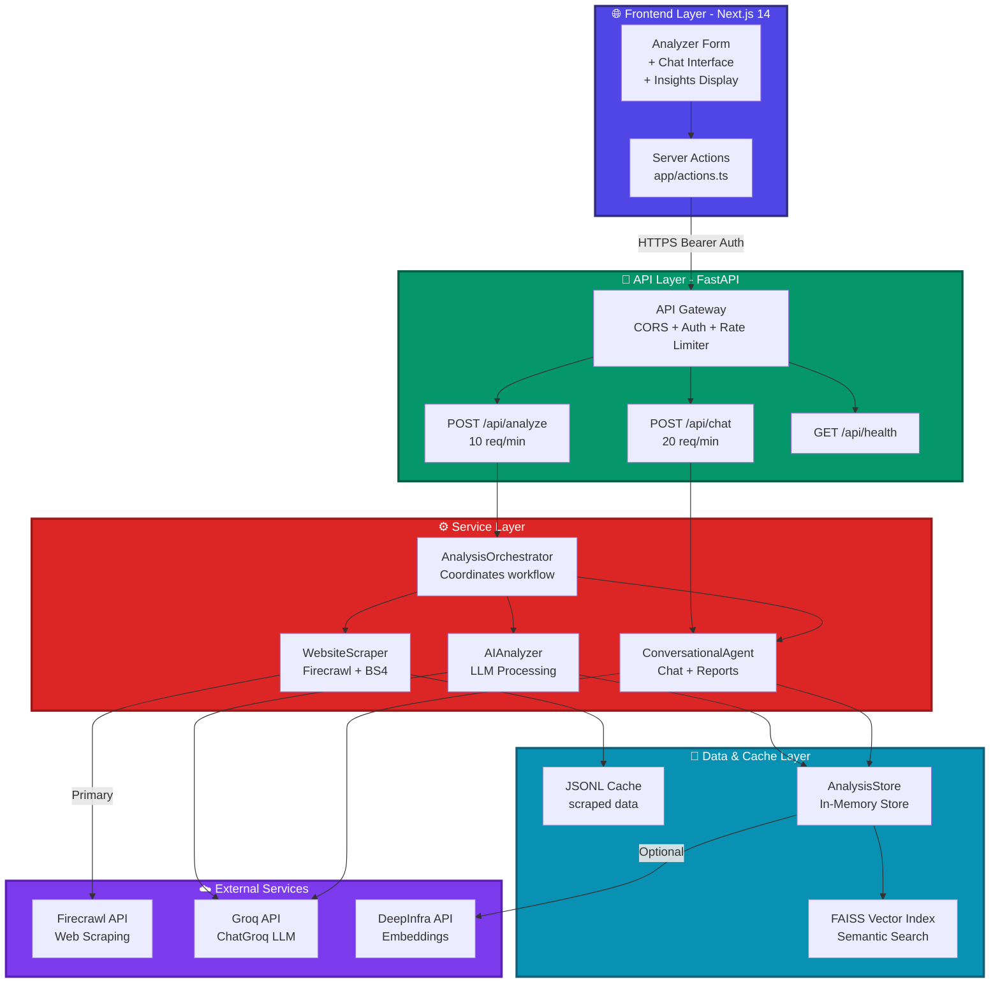

# Firmable AI Business Insight Agent

An end-to-end prototype: scrape a company homepage, derive structured business insights, and support conversational follow
## Deployment Notes

### Current Production Deployment

- **Frontend** – Deployed on Vercel at [firmable-ai-business-searcher.vercel.app](https://firmable-ai-business-searcher.vercel.app/)
  - Uses Next.js 14 server actions and edge-friendly APIs
  - Environment variables configured via Vercel dashboard
  - Automatic deployments from `main` branch

- **Backend** – Deployed on Railway at [firmable-ai-business-searcher-production.up.railway.app](https://firmable-ai-business-searcher-production.up.railway.app)
  - FastAPI with Docker containerization
  - Rate limiting with in-memory counters (10/min for analyze, 20/min for chat)
  - Automatic deployments from `main` branch

- **Secrets management** – Environment variables set in Vercel (frontend) and Railway (backend):
  - `API_SECRET_KEY` – Bearer token for API authentication
  - `GROQ_API_KEY` – Required for LLM analysis
  - `FIRECRAWL_API_KEY` – Optional, for enhanced scraping
  - `DEEPINFRA_API_KEY` – Optional, for semantic search features

### Alternative Deployment Options

- **Backend** – Can also run on Render, Heroku, or any Docker-compatible host
- **Scaling** – For clustered deployments, configure SlowAPI with Redis or Memcached for distributed rate limitingacked by cached analysis.

The system exposes two authenticated, rate-limited FastAPI endpoints (`/api/analyze` and `/api/chat`) and a Next.js interface that makes those capabilities easier to explore.


## 🛠️ Development Environment

**IDE Used**: Visual Studio Code, WebStorm (When I want to focus on frontend), v0 for initial UI

**Recommended Extensions**:
- Copilot
- Python (Microsoft)
- Pylance (Microsoft)
- ESLint
- Prettier - Code formatter
- Tailwind CSS IntelliSense

**Python Version**: 3.10+  
**Node Version**: 18+  
**Package Managers**: `uv` (Python), `pnpm` (Node.js)

---

## Key Capabilities

- **Single-page intelligence** – Uses Firecrawl (when available) or a hardened BeautifulSoup fallback to capture the homepage, normalise the content, and cache it locally.
- **LLM-backed analysis** – Groq’s ChatGroq client (default model `openai/gpt-oss-20b`) infers industry, company size, USP, target audience, sentiment, and more. Outputs are normalised and enriched with supporting text snippets.
- **Contact enrichment** – Deterministic parsers combined with LLM validation extract emails, phone numbers, addresses, and social links. `/api/analyze` merges the deterministic results with conversational contact intelligence.
- **Conversational follow-up** – `/api/chat` reuses the cached scrape + insight store so follow-up questions, business-intel summaries, or on-demand reports can be generated without re-scraping.
- **Safety & governance** – Bearer-token authentication, SlowAPI rate limiting (10/min for analysis, 20/min for chat), structured error envelopes, and request validation via Pydantic.
- **Modern UI** – A Next.js 14 frontend with Tailwind CSS, shadcn/ui components, server actions, and a chat workspace that mirrors the API contract (including custom questions and report generation).
- **Asynchronous architecture** – Non-blocking async/await patterns with thread pool offloading for CPU-intensive operations, enabling concurrent request handling without event loop blocking.

---

## Asynchronous Programming

The application implements asynchronous programming at multiple levels to handle concurrent requests efficiently:

### Implementation Details:

1. **Async Route Handlers**: All API endpoints use `async def` with FastAPI's native async capabilities, allowing the server to handle multiple requests concurrently.

2. **Non-blocking Execution**: Blocking operations (web scraping, LLM API calls, file I/O) are offloaded to thread pools using `asyncio.to_thread()`

3. **Parallel Processing**: `AIAnalyzer` uses `ThreadPoolExecutor` to run multiple LLM inference tasks concurrently, reducing total processing time:
   - Default insights extraction
   - Custom question answering
   - Contact information validation
   - Live website visits (when enabled)

### Performance Benefits:

- **Throughput**: Under load testing, the async architecture handles concurrent requests without blocking
- **Response Time**: Event loop remains responsive to new requests while heavy operations run in background threads
- **Resource Efficiency**: Better CPU utilization through concurrent execution of I/O-bound operations

---

## Architecture Overview

**For detailed architecture diagrams and design decisions**, see [ARCHITECTURE.md](./ARCHITECTURE.md) 

## High-Level Architecture Diagram




## High-Level Architecture

The system consists of:

- **Next.js Frontend** (Vercel)  Analyzer form with custom questions, insight cards, contact panels, and chat interface. Uses server actions to call the FastAPI backend with Bearer auth.
- **FastAPI Backend** (Railway/Local)  Two rate-limited endpoints:
  - /api/analyze (10/min)  orchestrator.analyze()
  - /api/chat (20/min)  conversational_agent.chat()
  - Includes rate limiting, auth middleware, and CORS
- **WebsiteScraper**  Firecrawl scrape (primary) with BeautifulSoup fallback, JSONL caching
- **AIAnalyzer**  Groq LLM extracts BusinessInsights (summary, industry, size, USP, etc.) and answers custom questions with sourced snippets
- **ConversationalAgent**  Caches scrape + insight bundle in AnalysisStore, handles chat Q&A, contact enrichment, and business reports

Supporting modules:

- `api/core/*`  shared settings, security, and limiter plumbing
- `api/data_store.py`  lightweight in-memory store with semantic search hooks for cached chunks
- `api/services/container.py`  lazily instantiates Groq clients, scraper, analyzer, and chat agent for dependency injection

---

## Technology Stack & Justification

### Backend Framework: FastAPI

**Why FastAPI?**
- **Async-First Architecture**: Native `async/await` support enables non-blocking I/O operations, critical for handling concurrent web scraping and LLM API calls without blocking the event loop
- **Automatic API Documentation**: Built-in OpenAPI/Swagger integration provides interactive API docs out of the box
- **Type Safety**: Pydantic integration ensures request/response validation at runtime with minimal boilerplate
- **Performance**: One of the fastest Python frameworks, comparable to Node.js and Go in benchmarks
- **Developer Experience**: Minimal code required for production-ready features (auth, CORS, rate limiting)

### Web Scraping: Firecrawl + BeautifulSoup4

**Why Firecrawl (Primary)?**
- **JavaScript Rendering**: Executes client-side JavaScript and waits for dynamic content to load, ensuring single-page applications (React, Vue, Angular) are fully rendered before extraction
- **Anti-Bot Circumvention**: Handles modern bot detection mechanisms (Cloudflare, reCAPTCHA) that would block standard HTTP clients
- **Structured Output**: Returns clean, markdown-formatted content optimized for LLM consumption
- **Reliability**: Cloud-based infrastructure handles complex scenarios (redirects, cookies, session management) that fail with local scraping
- **Scalability Over Playwright, Puperteer**: While Playwright and Puperteer offers similar JavaScript rendering capabilities, running browser instances in the backend is resource-intensive (high memory/CPU usage per session) and doesn't scale well under concurrent load. Firecrawl's cloud-based approach offloads this overhead, enabling the backend to remain lightweight and handle multiple requests efficiently.


**Why BeautifulSoup4 (Fallback)?**
- **Zero External Dependencies**: Works without API keys or network calls when Firecrawl is unavailable
- **Cost Efficiency**: Free fallback for static sites that don't require JavaScript execution
- **Deterministic Parsing**: Direct HTML parsing for sites with server-side rendering
- **Graceful Degradation**: Ensures the system remains operational even if external scraping services are down

### AI Infrastructure

**LLM: Groq API with OpenAI GPT-OSS-20B**

**Why Groq?**
- **Blazing Speed**: Industry-leading inference speed (~1,000 tokens/second) powered by custom LPU™ (Language Processing Unit) architecture, reducing response times from minutes to seconds
- **TruePoint Numerics**: Groq's proprietary quantization reduces precision only in areas that don't affect accuracy, preserving quality while delivering significant speedup over traditional approaches
- **Open-Source Models**: Hosts high-quality open-source models (Llama 3, Mixtral, Gemma, GPT-OSS) avoiding vendor lock-in
- **Cost-Effective**: Competitive pricing ($0.10/10M input tokens, $0.50/2M output tokens) with generous free tier for prototyping
- **Reliability**: Enterprise-grade infrastructure with 99.9% uptime SLA and automatic failover

**Why `openai/gpt-oss-20b` Model?**
- **Mixture-of-Experts (MoE) Architecture**: 20B total parameters with efficient sparse activation—only a subset of parameters active per token, enabling fast inference with small memory footprint
- **Tool Calling Excellence**: Optimized for agentic workflows with native support for function calling, browser search, and code execution—crucial for contact extraction and structured data generation
- **Massive Context Window**: 131K tokens (131,072) supports analyzing multiple homepage sections, product docs, and conversation history without truncation
- **Long Output Capability**: Up to 65,536 max output tokens enables comprehensive business reports, detailed analyses, and multi-turn conversations
- **Reasoning + JSON Modes**: Built-in reasoning capabilities with JSON Object/Schema modes ensure structured, validated outputs for business intelligence tasks
- **Cost-Efficient Deployment**: Compact model size with cached input pricing ($0.05/20M tokens) makes repeated analysis economical

**Embedding Model: BAAI/bge-m3 (via DeepInfra)**

**Why BGE-M3?**
- **Multilingual Excellence**: BGE-M3 (M3 = Multi-lingual, Multi-functionality, Multi-granularity) supports 100+ languages with superior cross-lingual retrieval capabilities
- **MTEB Leaderboard**: Consistently ranks in the top 10 on the Massive Text Embedding Benchmark (MTEB), outperforming many larger proprietary models
- **Cost-Effective**: DeepInfra's serverless pricing model charges only for actual usage, no minimum commitments
- **High Familiarity & Reliability**: Extensively tested across diverse embedding tasks with consistent performance (personal experiences)

---

## API Contract & Usage Examples

### Authentication

All API requests require Bearer token authentication:

```bash
Authorization: Bearer <API_SECRET_KEY>
```

### Rate Limits

| Endpoint | Rate limit | Description |
| --- | --- | --- |
| `POST /api/analyze` | 10 requests/min per IP | Scrapes the homepage, runs the LLM pipeline, merges deterministic + AI contact data, and returns `insights`, optional `custom_answers`, and supporting `source_chunks`. |
| `POST /api/chat` | 20 requests/min per IP | Answers follow-up questions using cached data; conversation history can be supplied to maintain context. |
| `GET /api/health`, `GET /health`, `GET /` | unrestricted | Health probes and minimal metadata used by the frontend bootstrap. |

---

## API Usage Examples

### 1. Analyze Endpoint - Basic Analysis

**Request:**
```bash
curl -X POST "https://firmable-ai-business-searcher-production.up.railway.app/api/analyze" \
  -H "Authorization: Bearer your-secret-key" \
  -H "Content-Type: application/json" \
  -d '{
    "url": "https://stripe.com"
  }'
```

**Response:**
```json
{
  "url": "https://stripe.com",
  "insights": {
    "summary": "Stripe is a financial infrastructure platform for internet businesses, providing payment processing APIs and tools for building online commerce experiences.",
    "industry": "Financial Technology (FinTech)",
    "company_size": "Large (>1000 employees)",
    "location": "San Francisco, CA, USA",
    "usp": "Developer-first payment infrastructure with comprehensive APIs, global payment support, and built-in fraud prevention",
    "products_services": "Payment processing APIs, billing platform, connect marketplace, terminal for in-person payments, fraud prevention tools, business financing",
    "target_audience": "Online businesses, SaaS companies, e-commerce platforms, marketplaces, and developers building payment solutions",
    "sentiment": "Professional, innovative, developer-focused, and trustworthy",
    "contact_info": {
      "emails": ["support@stripe.com"],
      "phones": ["+1 888-926-2289"],
      "contact_urls": ["https://stripe.com/contact"],
      "addresses": ["510 Townsend Street, San Francisco, CA 94103"],
      "social_media": {
        "linkedin": ["https://linkedin.com/company/stripe"],
        "twitter": ["https://twitter.com/stripe"],
        "github": ["https://github.com/stripe"]
      }
    },
    "source_chunks": {
      "industry": [
        {
          "chunk_index": 3,
          "chunk_text": "Financial infrastructure for the internet. Millions of companies use Stripe to accept payments...",
          "relevance_score": 0.92
        }
      ],
      "usp": [
        {
          "chunk_index": 5,
          "chunk_text": "Build your integration with developer-friendly APIs, or choose low-code or no-code options...",
          "relevance_score": 0.88
        }
      ]
    }
  },
  "timestamp": "2025-10-04T10:30:45.123456+00:00"
}
```

---

### 2. Analyze Endpoint - With Custom Questions

**Request:**
```bash
curl -X POST "https://firmable-ai-business-searcher-production.up.railway.app/api/analyze" \
  -H "Authorization: Bearer your-secret-key" \
  -H "Content-Type: application/json" \
  -d '{
    "url": "https://notion.so",
    "custom_questions": [
      "What is their pricing model?",
      "Do they offer a free tier?",
      "What integrations do they support?"
    ]
  }'
```

**Response:**
```json
{
  "url": "https://notion.so",
  "insights": {
    "summary": "Notion is an all-in-one workspace combining notes, docs, wikis, and project management tools for teams and individuals.",
    "industry": "Productivity Software / Collaboration Tools",
    "company_size": "Medium (250-1000 employees)",
    "location": "San Francisco, CA, USA",
    "usp": "Flexible, modular workspace with customizable databases and templates that adapts to any workflow",
    "products_services": "Note-taking, wiki creation, project management, databases, team collaboration, AI writing assistant",
    "target_audience": "Knowledge workers, teams, startups, students, and creative professionals",
    "sentiment": "Modern, flexible, empowering, and community-driven",
    "contact_info": {
      "emails": ["team@makenotion.com"],
      "contact_urls": ["https://notion.so/help"],
      "social_media": {
        "twitter": ["https://twitter.com/notionhq"],
        "linkedin": ["https://linkedin.com/company/notionhq"]
      }
    },
    "custom_answers": {
      "What is their pricing model?": "Notion offers a freemium pricing model: Free plan for individuals, Plus at $8/user/month for small teams, Business at $15/user/month for companies, and custom Enterprise pricing for large organizations. Annual billing provides a 20% discount.",
      "Do they offer a free tier?": "Yes, Notion offers a generous free tier for individual use with unlimited pages and blocks. It includes core features like databases, integrations, and 7-day page history.",
      "What integrations do they support?": "Notion supports 50+ integrations including Slack, Google Drive, GitHub, Figma, Jira, Asana, Trello, and Zapier. They also provide a public API for custom integrations."
    },
    "source_chunks": {
      "What is their pricing model?": [
        {
          "chunk_index": 12,
          "chunk_text": "Pricing Plans: Free for individuals, Plus $8/user/month, Business $15/user/month...",
          "relevance_score": 0.95
        }
      ],
      "Do they offer a free tier?": [
        {
          "chunk_index": 11,
          "chunk_text": "Get started for free. Unlimited pages & blocks, collaborate with up to 10 guests...",
          "relevance_score": 0.91
        }
      ]
    }
  },
  "timestamp": "2025-10-04T10:35:22.789012+00:00"
}
```

---

### 3. Chat Endpoint - Single Question

**Request:**
```bash
curl -X POST "https://firmable-ai-business-searcher-production.up.railway.app/api/chat" \
  -H "Authorization: Bearer your-secret-key" \
  -H "Content-Type: application/json" \
  -d '{
    "url": "https://stripe.com",
    "query": "Who are their main competitors?"
  }'
```

**Response:**
```json
{
  "url": "https://stripe.com",
  "query": "Who are their main competitors?",
  "response": "Based on the analyzed content, Stripe's main competitors in the payment processing and financial infrastructure space include:\n\n1. **PayPal/Braintree** - Established payment processor with strong brand recognition\n2. **Square** - Focuses on small businesses and point-of-sale solutions\n3. **Adyen** - Enterprise-focused payment platform popular in Europe\n4. **Checkout.com** - Developer-friendly alternative gaining market share\n5. **Traditional processors** - First Data, Worldpay, and legacy payment gateways\n\nStripe differentiates itself through superior developer experience, comprehensive API documentation, and modern infrastructure designed for internet businesses.",
  "timestamp": "2025-10-04T10:40:15.456789+00:00"
}
```

---

### 4. Chat Endpoint - Conversational Follow-up

**Request:**
```bash
curl -X POST "https://firmable-ai-business-searcher-production.up.railway.app/api/chat" \
  -H "Authorization: Bearer your-secret-key" \
  -H "Content-Type: application/json" \
  -d '{
    "url": "https://stripe.com",
    "query": "What makes them different from PayPal?",
    "conversation_history": [
      {
        "role": "user",
        "content": "Who are their main competitors?"
      },
      {
        "role": "assistant",
        "content": "Stripe'\''s main competitors include PayPal/Braintree, Square, Adyen, Checkout.com, and traditional processors like First Data and Worldpay..."
      }
    ]
  }'
```

**Response:**
```json
{
  "url": "https://stripe.com",
  "query": "What makes them different from PayPal?",
  "response": "Stripe differentiates from PayPal in several key ways:\n\n**Developer Experience:**\n- Stripe provides comprehensive REST APIs designed for developers to build custom payment flows\n- PayPal historically focused on hosted payment pages and redirects\n\n**Target Market:**\n- Stripe targets internet businesses, SaaS companies, and platforms requiring embedded payments\n- PayPal serves a broader consumer and small business market with emphasis on peer-to-peer transfers\n\n**Integration Approach:**\n- Stripe offers deep customization with extensive libraries (React, iOS, Android) for native experiences\n- PayPal provides simpler integration but less flexibility in payment UI/UX\n\n**Product Suite:**\n- Stripe builds full financial infrastructure (Connect for marketplaces, Billing for subscriptions, Terminal for in-person)\n- PayPal focuses primarily on checkout and money transfer functionality\n\n**Pricing Transparency:**\n- Stripe uses straightforward per-transaction pricing (2.9% + 30¢)\n- PayPal has more complex fee structures varying by transaction type",
  "timestamp": "2025-10-04T10:42:33.234567+00:00"
}
```

---

### 5. Chat Endpoint - Generate Business Report

**Request:**
```bash
curl -X POST "https://firmable-ai-business-searcher-production.up.railway.app/api/chat" \
  -H "Authorization: Bearer your-secret-key" \
  -H "Content-Type: application/json" \
  -d '{
    "url": "https://notion.so",
    "query": "Generate a comprehensive business intelligence report covering market position, competitive advantages, growth opportunities, and potential risks."
  }'
```

**Response:**
```json
{
  "url": "https://notion.so",
  "query": "Generate a comprehensive business intelligence report...",
  "response": "# Business Intelligence Report: Notion\n\n## Executive Summary\nNotion operates in the $15B+ productivity software market, positioned as an all-in-one workspace combining notes, wikis, databases, and project management. The company targets knowledge workers and teams seeking to consolidate fragmented tool stacks.\n\n## Market Position\n- **Industry:** Productivity & Collaboration Software\n- **Market Segment:** All-in-one workspace solutions\n- **Primary Competitors:** Confluence, Coda, Airtable, Monday.com, Microsoft Loop\n- **Market Share:** Estimated 5-7% of team collaboration market\n- **User Base:** 30M+ users globally (as of 2024)\n\n## Competitive Advantages\n\n### 1. Flexibility & Customization\n- Modular block-based interface adaptable to any workflow\n- Database functionality rivals dedicated tools like Airtable\n- Template marketplace with 5,000+ community contributions\n\n### 2. Developer Ecosystem\n- Public API enables custom integrations and automations\n- Strong developer community building extensions and workflows\n- 50+ native integrations with popular tools\n\n### 3. Product-Led Growth\n- Generous free tier drives viral adoption\n- Bottom-up adoption within organizations (individual → team → enterprise)\n- Network effects through shared templates and workspaces\n\n### 4. User Experience\n- Clean, intuitive interface with minimal learning curve\n- Cross-platform consistency (web, desktop, mobile)\n- Real-time collaboration without complexity of enterprise tools\n\n## Growth Opportunities\n\n### Near-Term (6-12 months)\n1. **AI Integration Expansion:** Leverage AI writing assistant as differentiator\n2. **Enterprise Features:** Enhanced admin controls, SSO, audit logs for larger deals\n3. **Vertical Templates:** Industry-specific solutions (healthcare, legal, education)\n\n### Medium-Term (1-2 years)\n1. **Workflow Automation:** Build native automation capabilities (reduce Zapier dependency)\n2. **Advanced Analytics:** Dashboard and reporting features for data-driven teams\n3. **International Expansion:** Localization for APAC and European markets\n\n### Long-Term (2-5 years)\n1. **Platform Play:** Become app marketplace for knowledge work tools\n2. **Financial Services:** Notion Payments for creator monetization\n3. **AI Agents:** Autonomous workspace assistants for routine tasks\n\n## Potential Risks\n\n### Competitive Threats\n- **Microsoft Loop:** Bundled with Office 365, threatening enterprise adoption\n- **Coda:** Similar flexibility with stronger automation capabilities\n- **Specialized Tools:** Best-of-breed solutions may outperform all-in-one approach\n\n### Technical Risks\n- Performance degradation with large workspaces (known user complaint)\n- Offline functionality limitations compared to competitors\n- Data lock-in concerns hindering enterprise adoption\n\n### Business Model Risks\n- Heavy reliance on freemium conversion (estimated 2-3% conversion rate)\n- Price sensitivity in SMB market\n- Churn risk if onboarding/training insufficient\n\n### Market Risks\n- Economic downturn reducing SaaS budgets\n- Consolidation trend favoring integrated suites (Microsoft, Google)\n- Remote work decline potentially reducing collaboration tool demand\n\n## Recommendations\n\n1. **Double down on AI:** Differentiate through intelligent assistance and content generation\n2. **Improve performance:** Address scalability concerns to retain power users\n3. **Strengthen enterprise:** Build features required for Fortune 500 adoption\n4. **Expand integration ecosystem:** Become central hub connecting all business tools\n5. **Community investment:** Leverage template creators and consultants as growth channel",
  "timestamp": "2025-10-04T10:45:18.901234+00:00"
}
```

---

### 6. Error Response Examples

**Missing Authentication:**
```json
{
  "detail": "Not authenticated"
}
```

**Rate Limit Exceeded:**
```json
{
  "detail": "Rate limit exceeded: 10 per 1 minute"
}
```

**Invalid URL:**
```json
{
  "detail": [
    {
      "type": "value_error",
      "loc": ["body", "url"],
      "msg": "Invalid URL format",
      "input": "not-a-url"
    }
  ]
}
```

**Analysis Not Found (Chat):**
```json
{
  "detail": "No cached analysis found for https://example.com. Please run /api/analyze first."
}
```

---

## API Contract

Requests must include `Authorization: Bearer <API_SECRET_KEY>`.

### `/api/analyze` Response Shape

```jsonc
{
  "url": "https://example.com",
  "insights": {
    "summary": "...",
    "industry": "Software-as-a-Service",
    "company_size": "Medium",
    "location": "Austin, TX",
    "usp": "AI-native workflow automation",
    "products_services": "Automation studio, integrations marketplace",
    "target_audience": "Revenue operations teams",
    "sentiment": "Innovative and confident",
    "contact_info": {
      "emails": ["hello@example.com"],
      "phones": ["+1 512-555-0101"],
      "contact_urls": ["https://example.com/contact"],
      "addresses": ["123 Main Street, Austin, TX"],
      "social_media": {"linkedin": ["https://linkedin.com/company/example"]}
    },
    "custom_answers": {
      "What is their pricing model?": "Subscription tiers with annual billing options"
    },
    "source_chunks": {
      "industry": [{"chunk_index": 2, "chunk_text": "...", "relevance_score": 0.87}],
      "What is their pricing model?": [{"chunk_index": 5, "chunk_text": "..."}]
    }
  },
  "timestamp": "2025-10-03T22:14:05.123456+00:00"
}
```

### `/api/chat` Request/Response

```jsonc
// Request body
{
  "url": "https://n8n.com",
  "query": "Who are their primary competitors?",
  "conversation_history": [
    {"role": "user", "content": "What do they build?"},
    {"role": "assistant", "content": "They specialise in workflow automation software."}
  ]
}

// Response
{
  "url": "https://n8n.com",
  "query": "Who are their primary competitors?",
  "response": "Competitive messaging references Zapier, Make.com, and Workato as direct alternatives.",
  "timestamp": "2025-10-03T22:16:12.009812+00:00"
}
```

The frontend’s “Generate Business Report” button simply poses a long-form question to `/api/chat`
---

## Local Development

### 1. Prerequisites

- Node.js 18+
- pnpm 8+ (or npm/yarn if you prefer, but the lockfile is pnpm)
- Python 3.10+
- [uv](https://github.com/astral-sh/uv) (preferred) or pip for Python dependency management
- Groq API key (required) and, optionally, a Firecrawl API key for richer scraping
- e

### 2. Environment Variables

Copy `.env.example` to `.env.local` in the repo root and fill in the secrets:

```env
API_URL=http://localhost:8000
API_SECRET_KEY=dev-secret-key
GROQ_API_KEY=gsk_YOUR_KEY
FIRECRAWL_API_KEY=fc_YOUR_KEY          # optional but recommended
DEEPINFRA_API_KEY=di_OPTIONAL_KEY     # optional, used for extended semantic features
```

The same file is consumed by server actions in the Next.js app and the FastAPI backend.

### 3. Install Dependencies

```bash
# Frontend
pnpm install   # or npm install

# Backend
uv sync        # creates an isolated .venv based on pyproject.toml / uv.lock
```

### 4. Run the Stack

```bash
# Terminal 1 – FastAPI (reload on change)
uv run uvicorn api.index:app --reload --port 8000

# Terminal 2 – Next.js frontend
pnpm dev       # serves http://localhost:3000
```

The frontend performs a health check before every API call; if the backend is unreachable or misconfigured it will surface actionable guidance in the UI.

---

## Testing

The backend ships with a comprehensive, fixture-driven API test suite located at `api/test_api.py`.

```bash
# Run the whole suite with uv (preferred)
uv run --project . pytest api/test_api.py -v

# Optional: coverage report
uv run --project . pytest api/test_api.py --cov=api --cov-report=term-missing
```

Tests cover:

- Authentication failures and success paths
- Request validation (invalid URLs, missing fields)
- `/api/analyze` orchestration, including custom question augmentation
- `/api/chat` conversational flows with history
- Integration with the cached orchestrator + chat agent stubs
- Health endpoints and rate limiting semantics

---

## Deployment Notes

- **Frontend** – Designed for Vercel (uses server actions and edge-friendly APIs). Supply the same environment variables via Vercel’s dashboard.
- **Backend** – Can run on Railway or any container-friendly host. Rate limiting relies on in-memory counters by default; for clustered deployments configure a SlowAPI-compatible backend (Redis, Memcached, etc.).
- **Secrets management** – Set `API_SECRET_KEY`, `GROQ_API_KEY`, and optional API keys in your hosting provider

---

## Future Enhancements

- Multi-page crawling with domain guards and queue limits
- Pluggable semantic search (e.g., DeepInfra or OpenAI embeddings stored in vector DBs)
- Export routes for saved analyses (CSV/PDF/webhook)
- Workspace persistence (swap in Postgres/Redis for the in-memory `AnalysisStore`)


